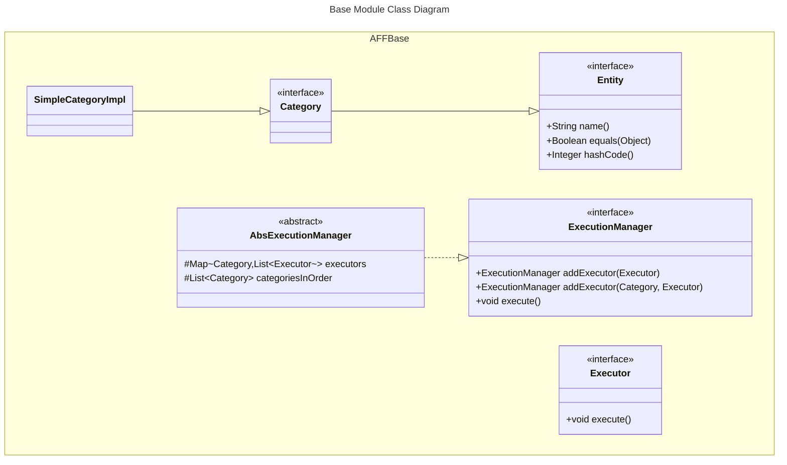
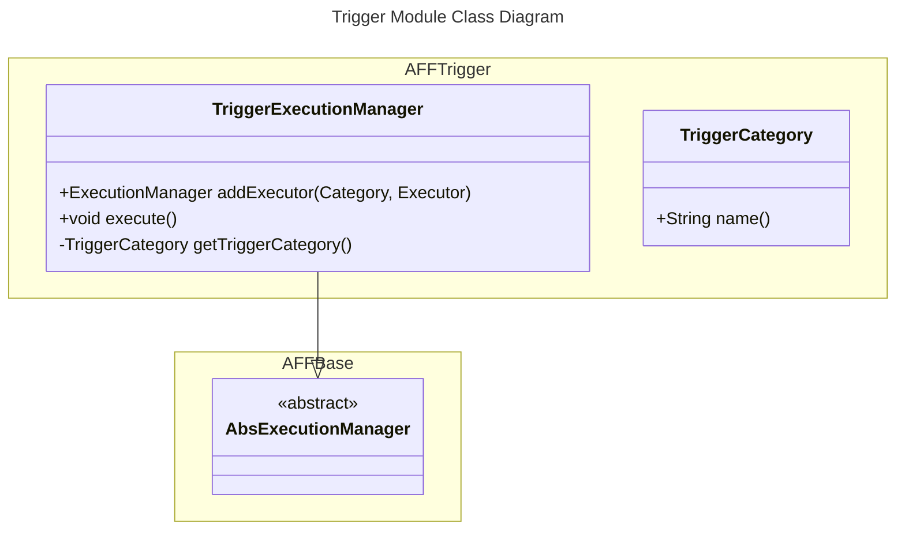
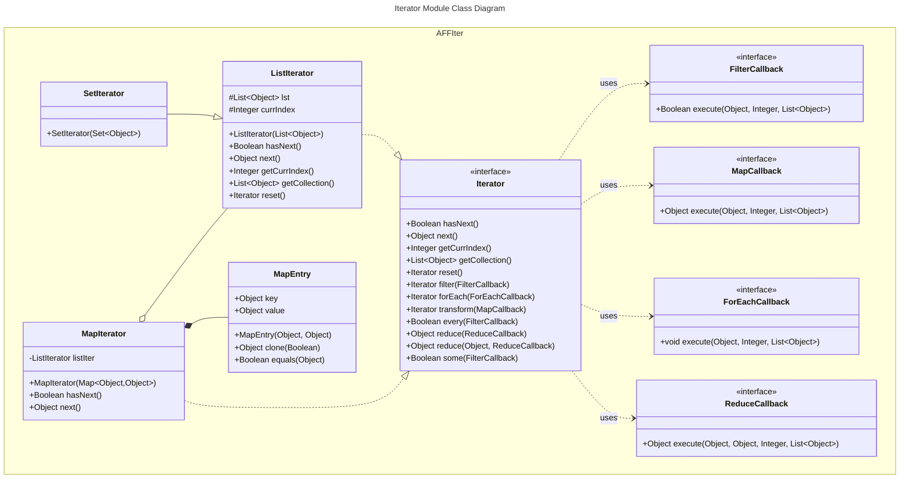
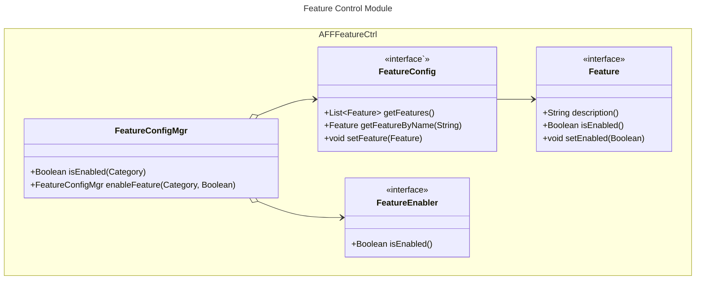
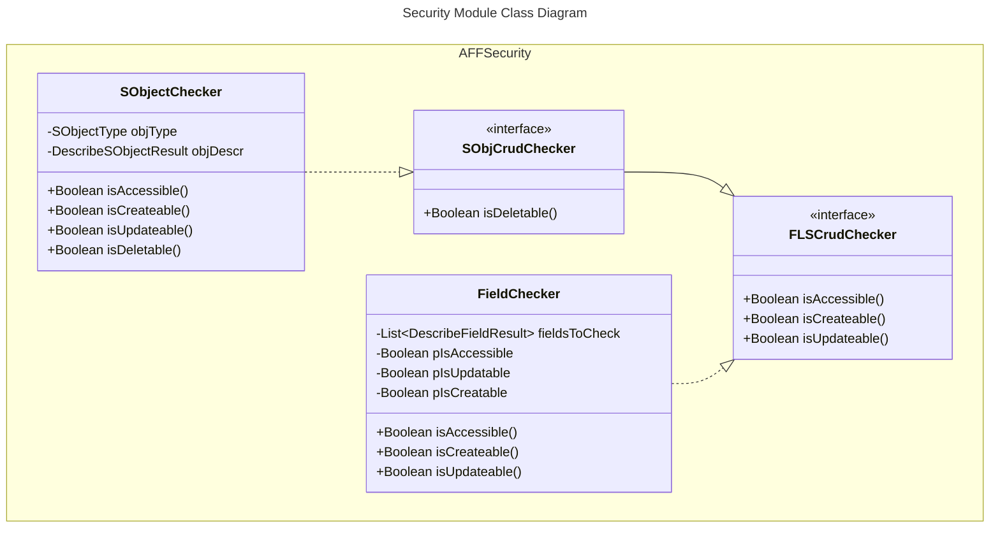
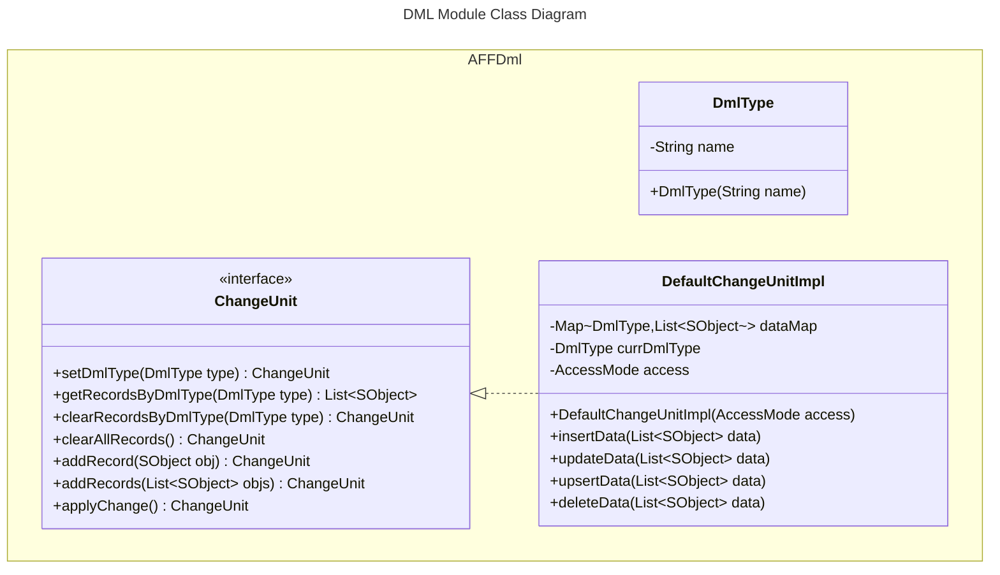
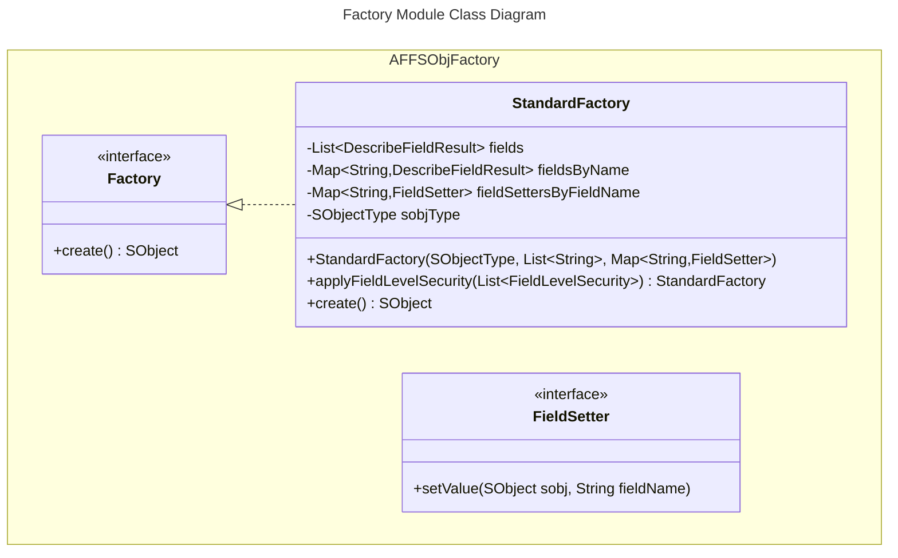
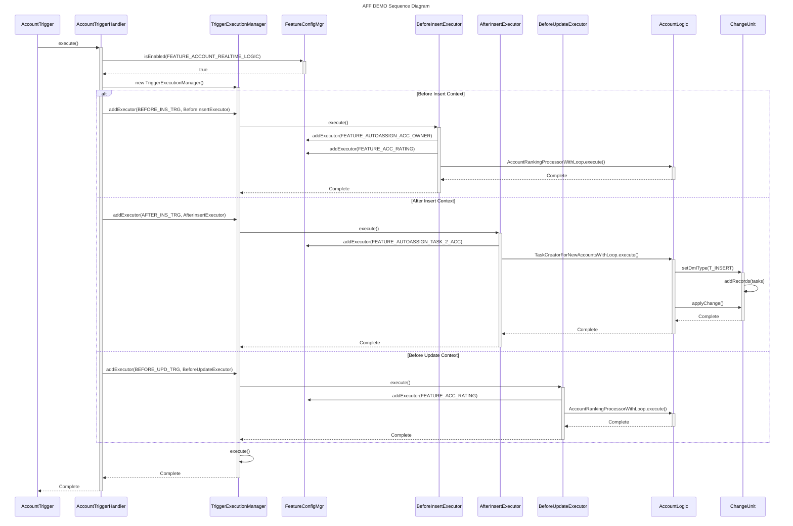

# AFF - Apex Foundation Framework

```
       _,-._
      / \_/ \
      >-(_)-<   AFF
      \_/ \_/
        `-'
      Apex Foundation Framework
```

## Overview

AFF is a modular framework for Salesforce Apex development that provides foundational building blocks to streamline development of enterprise applications. The framework is designed with loose coupling in mind, allowing developers to use only the components they need without bringing in unnecessary dependencies. Each module can be used independently or in combination with others, allowing developers to choose only the components they need.

<details>
    <summary><b>Core Architecture</b></summary>

## Core Architecture

### Executors

Executors are the fundamental building blocks of the framework. They represent context-independent units of business logic that can be invoked from:

* Triggers
* Web Services
* Batch Jobs
* Scheduled Jobs
* Queueable Jobs
* Controllers
* Any Apex context

#### Example of a reusable executor:

```apex
public inherited sharing class AccountProcessor implements AFFBase.Executor {
    private List<Account> accounts;
    private AFFDml.ChangeUnit changeUnit;
    
    public AccountProcessor(List<Account> accounts, AFFDml.ChangeUnit changeUnit) {
        this.accounts = accounts;
        this.changeUnit = changeUnit;
    }
    
    public void execute() {
        // Business logic
        processAccounts();
    }
}
```

#### Usage across different contexts:

```apex
// In trigger
public with sharing class AccountTriggerHandler {
    public void execute() {
        new AccountProcessor(
            Trigger.new, 
            new AFFDml.DefaultChangeUnitImpl(AFFDml.AccessMode.USER_MODE)
        ).execute();
    }
}

// In batch
public without sharing class AccountBatch implements Database.Batchable<SObject> {
    public void execute(Database.BatchableContext bc, List<Account> scope) {
        new AccountProcessor(
            scope,
            new AFFDml.DefaultChangeUnitImpl(AFFDml.AccessMode.SYSTEM_MODE)
        ).execute();
    }
}

// In API
@RestResource(urlMapping='/accounts/*')
global with sharing class AccountAPI {
    @HttpPost
    global static void processAccounts(List<Account> accounts) {
        new AccountProcessor(
            accounts,
            new AFFDml.DefaultChangeUnitImpl(AFFDml.AccessMode.USER_MODE)
        ).execute();
    }
}
```

### Execution Patterns

The framework supports two primary execution patterns:

#### 1. One Loop Per Executor

```apex
public class MyExecutor implements AFFBase.Executor {
    private List<SObject> records;
    
    public void execute() {
        for(SObject record : records) {
            // Process single record
        }
    }
}
```

**Advantages**

* Clear separation of concerns
* Easy to maintain and test
* Each executor owns it's loop
* Better error isolation

**Disadvantages**

* Multiple passes through the data
* More CPU time consumption
* May hit governor limits with large data sets

#### One Loop - Many Executors

```apex
public inherited sharing class MyExecutor 
    implements AFFBase.Executor, AFFBase.DataSetter 
{
    private SObject record;
    
    public AFFBase.DataSetter setData(Object data) {
        this.record = (SObject)data;
        return this;
    }
    
    public void execute() {
        // Process single record
    }
}

// Usage
for(SObject record : records) {
    ((AFFBase.Executor)executor1.setData(record)).execute();
    ((AFFBase.Executor)executor2.setData(record)).execute();
}
```

**Advantages:**
* Single pass through the data
* More CPU efficient
* Better for large data volumes
* Lower memory usage

**Disadvantages:**
* More complex execution flow
* Harder to debug
* Tighter coupling between executors

### When to Use Which Pattern

1. Use One Loop Per Executor when:
   - Operations are independent
   - Memory is not a concern
   - Simple maintenance is priority
   - Debugging needs are high

2. Use One Loop - Many Executors when:
   - Operations are interdependent
   - Processing large data volumes
   - CPU time is critical
   - Operations need to share context

</details>

<details>
    <summary><b>Framework Modules</b></summary>

## Framework Modules

<details style="padding-left:20px;">
    <summary><b>Base Module</b></summary>

### Base Module
**Required Classes**: `AFFBase`

The base module provides core interfaces and classes used throughout the framework.



Key Components:
- Entity: Interface for named entities
- Executor: Interface for executable units of work
- ExecutionManager: Interface for managing categorized executors
- Category: Interface for categorizing executors

    </details>

<details style="padding-left:20px;">
    <summary><b>Trigger Module</b></summary>

### Trigger Module
**Required Classes**: `AFFBase`, `AFFTrigger`

The trigger module provides structured trigger handling with comprehensive support for different trigger contexts.



#### Example Implementation:

```apex
trigger AccountTrigger on Account (before insert, after insert) {
    new AccountTriggerHandler(
        Trigger.new, Trigger.old,
        Trigger.newMap, Trigger.oldMap
    ).execute();
}

public class AccountTriggerHandler implements AFFBase.Executor {
    public void execute() {
        new AFFTrigger.TriggerExecutionManager()
            .addExecutor(AFFTrigger.BEFORE_INS_TRG, new Validator())
            .addExecutor(AFFTrigger.BEFORE_INS_TRG, new Defaulter())
            .addExecutor(AFFTrigger.AFTER_INS_TRG, new NotificationSender())
            .execute();
    }
}
```

#### Example: Combined Pattern Usage

```apex
public class AccountTriggerHandler implements AFFBase.Executor {
    // ...
    public void execute() {
        // One Loop - Many Executors for field updates
        new AccountFieldUpdaters(Trigger.new).execute();
        
        // One Loop Per Executor for independent operations
        new OpportunityCreator(Trigger.new).execute();
        new TaskCreator(Trigger.new).execute();
    }
}

// Field updaters using one loop - many executors
public class AccountFieldUpdaters implements AFFBase.Executor {
    private List<SObject> accounts;
    private List<AFFBase.Executor> fieldUpdaters;
    
    //...

    public void execute() {
        for(Account acc : accounts) {
            for(AFFBase.Executor updater : fieldUpdaters) {
                ((AFFBase.DataSetter)updater).setData(acc);
                updater.execute();
            }
        }
    }
}
```

#### Trigger Context Data

The framework intentionally uses shallow copies of trigger context data:

```apex
new MyTriggerHandler(
    Trigger.new,    // Shallow copy
    Trigger.old,    // Shallow copy
    Trigger.newMap, // Shallow copy
    Trigger.oldMap  // Shallow copy
).execute();
```

**Why Not Immutable?**
1. Performance Considerations
   - Deep cloning large datasets would consume heap space
   - Additional CPU time for cloning operations
   - Memory constraints with governor limits

2. Intended Behavior
   - Trigger handlers often need to modify records
   - Changes need to propagate to the database
   - Pattern follows Salesforce's native trigger behavior

3. Best Practices
   - Handle data modifications in appropriate trigger contexts (before triggers for record modifications)
   - Use clear execution order to prevent unexpected modifications
   - Document when and where modifications occur

#### Best Practices

1. Data Modification
   - Modify records only in before triggers
   - Use after triggers for related object operations
   - Document any record modifications

2. Execution Pattern Selection
   - Use "One Loop Per Executor" for simpler, independent operations
   - Use "One Loop - Many Executors" for complex, interdependent operations
   - Consider data volume when choosing patterns

3. Error Handling
   - Implement proper error handling in each executor
   - Use feature toggles for graceful degradation
   - Consider transaction scope in error scenarios

4. Performance
   - Monitor CPU time and heap size
   - Batch operations where possible
   - Use appropriate execution pattern for data volume

5. Testing
   - Test each executor independently
   - Test execution order scenarios
   - Verify error handling
   - Test with various data volumes

</details>

<details style="padding-left:20px;">
    <summary><b>Iterator Module</b></summary>

### Iterator Module and Functional Programming
**Required Classes**: `AFFIter`, `AFFCommons`

The Iterator module provides functional programming patterns for Apex, inspired by JavaScript's array methods. All functional operations (`transform`, `filter`, `forEach`, etc.) are immutable by design, ensuring data consistency and preventing side effects.



#### Example Usage:

```apex
// Using filter and transform
AFFIter.Iterator it = new AFFIter.ListIterator(accounts);
List<Task> tasks = (List<Task>)it
    .filter(new HighValueAccountFilter())
    .transform(new AccountToTaskTransformer())
    .getCollection();

// Using forEach with immutable operations
it.forEach(new AccountProcessor())
  .forEach(new NotificationSender());
```

#### Callbacks:
```apex
// Filter callback example
public class HighValueAccountFilter implements AFFIter.FilterCallback {
    public Boolean execute(Object item, Integer i, List<Object> arr) {
        Account acc = (Account)item;
        return acc.AnnualRevenue > 1000000;
    }
}

// Transform callback example
public class AccountToTaskTransformer implements AFFIter.MapCallback {
    public Object execute(Object item, Integer i, List<Object> arr) {
        Account acc = (Account)item;
        return new Task(
            WhatId = acc.Id,
            Subject = 'Follow up',
            ActivityDate = Date.today().addDays(7)
        );
    }
}
```

#### Immutability Guarantee

All operations create new collections:

```apex
List<Account> accounts = [SELECT Id, Name FROM Account];
AFFIter.Iterator it = new AFFIter.ListIterator(accounts);

// Each operation creates new collection
Iterator filtered = it.filter(new IsActive());     // New collection
Iterator transformed = filtered.transform(new AccountWrapper()); // New collection
Iterator processed = transformed.forEach(new AccountProcessor()); // New collection

// Original iterator remains unchanged
System.assert(it.getCollection() != filtered.getCollection());
```
#### Best Practices

1. Leverage Immutability
   - Rely on the guaranteed immutability for safe parallel processing
   - Use the same iterator for multiple processing paths
   - Don't worry about operations affecting source data

2. Performance Considerations
   - Be aware that each operation creates new collections
   - Consider the trade-off between immutability and memory usage
   - Use batch processing for very large datasets

3. Chain Design
   - Create clear, intention-revealing chains
   - Split complex operations into meaningful steps
   - Take advantage of the ability to reuse iterators

4. Testing
   - Verify immutability in tests
   - Test multiple processing paths
   - Ensure source data remains unchanged

#### Notes on Deep Cloning

The Iterator module uses `AFFCommons.deepClone()` for copying objects, which handles:
- SObjects using `clone(true, true, true, true)`
- Custom objects implementing `AFFCommons.Cloneable`
- Collections and primitive types

```apex
// Example of a custom object working with Iterator
public class MyCustomObject implements AFFCommons.Cloneable {
    public String name;
    public Decimal value;
    
    public Object clone(Boolean deepClone) {
        MyCustomObject cloned = new MyCustomObject();
        cloned.name = this.name;
        cloned.value = this.value;
        return cloned;
    }
}

// Will be properly cloned in Iterator operations
List<MyCustomObject> objects = new List<MyCustomObject>();
AFFIter.Iterator it = new AFFIter.ListIterator(objects);
```
</details>

<details style="padding-left:20px;">
    <summary><b>Feature Control Module</b></summary>

### Feature Control Module
**Required Classes**: `AFFFeatureCtrl`, `AFFBase`

The Feature Control Module provides a flexible system for managing feature toggles in your Salesforce application. It allows you to enable/disable functionality dynamically based on various conditions, without deploying new code.



#### Example Implementation:

```apex
// Feature definition
public static final AFFBase.Category FEATURE_ACC_RATING =
    new AFFBase.SimpleCategoryImpl('FEATURE_ACC_RATING');

// Feature configuration
AFFFeatureCtrl.FeatureConfig featureConfig = new AFFFeatureCtrl.FeatureConfigImpl();
featureConfig.setFeatures(new List<AFFFeatureCtrl.Feature>{
    new AFFFeatureCtrl.FeatureImpl(
        new AFF_Features_Control_Config__mdt(
            DeveloperName = 'FEATURE_ACC_RATING',
            IsEnabled__c = true
        )
    )
});

// Feature enabler for business hours
public class BusinessHoursFeatureEnabler implements AFFFeatureCtrl.FeatureEnabler {
    private BusinessHours bh;
    public Boolean isEnabled() {
        if ( bh == null ) {
            bh = [SELECT Id FROM BusinessHours WHERE IsDefault = true LIMIT 1];
        }
        return BusinessHours.isWithin(bh.Id, Datetime.now());
    }
}

// Usage
AFFFeatureCtrl.FeatureConfigMgr featureManager = (
        new AFFFeatureCtrl.FeatureConfigMgr(
            featureConfig,
            new List<AFFFeatureCtrl.FeatureEnabler>{
                new BusinessHoursFeatureEnabler()
            }
        )
    ).execute(); // Execute feature-specific code if enabled

```

#### Performance Considerations

1. Caching Feature States
```apex
public class CachedFeatureManager {
    private static Map featureStateCache;
    
    public static Boolean isEnabled(AFFBase.Category feature) {
        if (featureStateCache == null) {
            featureStateCache = new Map();
        }
        
        String featureName = feature.name();
        if (!featureStateCache.containsKey(featureName)) {
            featureStateCache.put(
                featureName, 
                featureManager.isEnabled(feature)
            );
        }
        
        return featureStateCache.get(featureName);
    }
}
```

2. Bulk Processing
```apex
public class BulkFeatureChecker {
    public Map checkFeatures(Set featureNames) {
        Map results = new Map();
        // Bulk query feature configurations
        for(AFF_Features_Control_Config__mdt config : 
            [SELECT DeveloperName, IsEnabled__c 
             FROM AFF_Features_Control_Config__mdt 
             WHERE DeveloperName IN :featureNames]) {
            results.put(config.DeveloperName, config.IsEnabled__c);
        }
        return results;
    }
}
```

</details>

<details style="padding-left:20px;">
    <summary><b>Security Module</b></summary>

### Security Module
**Required Classes**: `AFFSecurity`

The Security Module provides an efficient way to check Field-Level Security (FLS) and object CRUD permissions. It uses lazy loading and caching of field descriptions to optimize performance when checking multiple fields.



#### Example Usage:

```apex
// Field-level security checking
AFFSecurity.FieldChecker fieldChecker = new AFFSecurity.FieldChecker(
    Account.SObjectType,
    new List<String>{'Name', 'Industry', 'AnnualRevenue'}
);

if (fieldChecker.isAccessible() && fieldChecker.isUpdateable()) {
    // Process fields
}

// Object-level security checking
AFFSecurity.SObjectChecker objectChecker = 
    new AFFSecurity.SObjectChecker(Account.SObjectType);

if (objectChecker.isCreateable()) {
    // Create records
}
```

#### Best Practices

1. Cache Checkers When Possible
```apex
public class SecurityService {
    private static Map<String, AFFSecurity.FieldChecker> checkersByObject = 
        new Map<String, AFFSecurity.FieldChecker>();
    
    public static AFFSecurity.FieldChecker getChecker(
        SObjectType objType, 
        List<String> fields
    ) {
        String key = objType + String.join(fields, ',');
        if (!checkersByObject.containsKey(key)) {
            checkersByObject.put(
                key, 
                new AFFSecurity.FieldChecker(objType, fields)
            );
        }
        return checkersByObject.get(key);
    }
}
```
Reuse checker instances for common field combinations.

2. Group Related Fields
```apex
public class AccountSecurityProfile {
    private static final List<String> BASIC_FIELDS = 
        new List<String>{'Name', 'Phone'};
    private static final List<String> FINANCIAL_FIELDS = 
        new List<String>{'AnnualRevenue', 'AccountNumber'};
        
    private static AFFSecurity.FieldChecker basicChecker;
    private static AFFSecurity.FieldChecker financialChecker;
    
    public static Boolean canAccessBasicInfo() {
        if (basicChecker == null) {
            basicChecker = new AFFSecurity.FieldChecker(
                Account.SObjectType, 
                BASIC_FIELDS
            );
        }
        return basicChecker.isAccessible();
    }
}
```
Organize field checks by functional area.

3. Error Handling
```apex
public class SecureOperation {
    private AFFSecurity.FieldChecker checker;
    
    public void execute() {
        try {
            validateAccess();
            // Perform operation
        } catch (SecurityException e) {
            handleSecurityError(e);
        }
    }
    
    private void validateAccess() {
        if (!checker.isAccessible()) {
            throw new SecurityException(
                'Insufficient access to fields: ' + 
                String.join(fields, ',')
            );
        }
    }
}
```
Provide clear security error messages.

#### Performance Tips

1. Minimize Describe Calls
```apex
// DO THIS - one checker for multiple operations
AFFSecurity.FieldChecker checker = new AFFSecurity.FieldChecker(
    Account.SObjectType,
    new List<String>{'Name', 'Industry'}
);
checker.isAccessible();
checker.isUpdateable();

// NOT THIS - multiple checkers
new AFFSecurity.FieldChecker(Account.SObjectType, fields).isAccessible();
new AFFSecurity.FieldChecker(Account.SObjectType, fields).isUpdateable();
```

2. Use Appropriate Cache Scope
```apex
public class SecurityCache {
    // Transaction cache for standard operations
    private static Map<String, AFFSecurity.FieldChecker> transactionCache = 
        new Map<String, AFFSecurity.FieldChecker>();
        
    // Cache key generator
    private static String generateKey(SObjectType objType, List<String> fields) {
        return objType + String.valueOf(fields.hashCode());
    }
}
```

3. Batch Operation Optimization
```apex
public class BatchSecurityCheck {
    private AFFSecurity.FieldChecker checker;
    
    public void processRecords(List<SObject> records) {
        // Check once for the batch
        if (!checker.isAccessible()) {
            throw new SecurityException('Insufficient access');
        }
        // Process records
    }
}
```

The Security Module's lazy loading and caching mechanisms make it particularly efficient for:
- High-volume operations
- Repeated security checks
- Complex permission validations
- Batch processing

By caching field descriptions and permission results, it minimizes the overhead of security checks while maintaining proper security enforcement.

</details>

<details style="padding-left:20px;">
    <summary><b>DML Module</b></summary>

### DML Module
**Required Classes**: `AFFDml`, `AFFBase`

The DML Module provides structured database operations with transaction management.



#### Examples

##### 1. Basic Insert Operation:

```apex
// Create a change unit with user mode access
AFFDml.ChangeUnit cu = new AFFDml.DefaultChangeUnitImpl(AFFDml.AccessMode.USER_MODE);

// Add records to insert
cu.setDmlType(AFFDml.T_INSERT)
  .addRecord(new Account(Name = 'Test Account'))
  .applyChange();
```

##### 2. Multiple DML Operations:

```apex
AFFDml.ChangeUnit cu = new AFFDml.DefaultChangeUnitImpl(AFFDml.AccessMode.SYSTEM_MODE);

// Insert new accounts
cu.setDmlType(AFFDml.T_INSERT)
  .addRecords(newAccounts);
  // Update existing accounts
  .setDmlType(AFFDml.T_UPDATE)
  .addRecords(existingAccounts);
  // Apply all changes at once
  .applyChange();
```

##### 3. Error Handling:

```apex
AFFDml.ChangeUnit cu = new AFFDml.DefaultChangeUnitImpl(AFFDml.AccessMode.USER_MODE);

try {
    cu.setDmlType(AFFDml.T_INSERT)
      .addRecords(accounts)
      .applyChange();
} catch (AFFDml.BadDataException e) {
    // Handle error
}
```
#### Best Practices and Optimizations

##### Batch Operations

Group similar DML operations together to minimize DML statements
Use addRecords() for bulk operations instead of multiple addRecord() calls


##### Access Mode Selection

Use USER_MODE when the operation should respect user permissions
Use SYSTEM_MODE only when bypassing user permissions is necessary


##### Error Handling

1. Always wrap DML operations in try-catch blocks
2. Clear previous records using `clearRecordsByDmlType()` when reusing a change unit


#### Performance Considerations

1. Minimize the number of `applyChange()` calls
2. Use getRecordsByDmlType() to verify records before applying changes
3. Clear unnecessary data using `clearAllRecords()` when reusing change units


#### Memory Management

1. Clear large data sets after processing using `clearAllRecords()`
2. Avoid storing unnecessary references to large record collections

</details>

<details style="padding-left:20px;">
    <summary><b>Factory Module</b></summary>

### Factory Module
**Required Classes**: `AFFSObjFactory`

The SObject Factory Module provides a flexible and secure way to create SObject records with proper field-level security checks and default value handling. It enforces compile-time type safety and supports custom field value setting strategies.



#### Examples

```apex
// Custom field setter
public class AccountNameSetter implements AFFSObjFactory.FieldSetter {
    public void setValue(SObject obj, String fieldName) {
        obj.put(fieldName, 'Account-' + Crypto.getRandomInteger());
    }
}

// Factory setup
Map<String, AFFSObjFactory.FieldSetter> fieldSetters = 
    new Map<String, AFFSObjFactory.FieldSetter>{
        'Name' => new AccountNameSetter()
    };

// Use field setter for Name and default value for Industry
AFFSObjFactory.Factory factory = new AFFSObjFactory.StandardFactory(
    Account.SObjectType,
    new List<String>{'Name', 'Industry'},
    fieldSetters
)
// Apply field level security
.applyFieldLevelSecurity(new List<AFFSObjFactory.FieldLevelSecurity>{
    AFFSObjFactory.FieldLevelSecurity.FLS_CREATE,
    AFFSObjFactory.FieldLevelSecurity.FLS_READ
});

// Create SObject
Account acc = (Account)factory.create();
```

#### Best Practices and Optimizations

##### Factory Creation
- Create factories once and reuse them for better performance
- Group related fields together in a single factory
- Use descriptive field setter names for better maintainability

##### Field-Level Security
- Always apply appropriate FLS checks based on operation context
- Cache FLS check results when creating multiple records
- Consider using system mode for batch operations when appropriate

##### Error Handling
- Handle WrongFieldException for invalid field names
- Validate required fields before creating records
- Implement proper error logging for field setter failures

##### Performance Considerations
- Cache describe results and field maps
- Batch create operations when possible
- Minimize the number of field setters for frequently used factories

##### Field Setters
- Keep field setters stateless when possible
- Implement field validation in setters when needed
- Use dependency injection for complex field setting logic

</details>

<details style="padding-left:20px; padding-bottom:20px;">
    <summary><b>Commons Module</b></summary>

### Commons Module
**Required Classes**: `AFFCommons`

The Commons Module provides utility functions for:
- Hash building
- Deep cloning
- Type utilities

Example Usage:

```apex
// Hash building
AFFCommons.HashBuilder hashBuilder = new AFFCommons.HashBuilder();
Integer hash = hashBuilder
    .add(account.Name)
    .add(account.Industry)
    .hashCode();

// Deep cloning
Account clonedAccount = (Account)AFFCommons.deepClone(account);

// Type utilities
String objType = AFFCommons.getObjectType(myObject);
Type resolvedType = AFFCommons.getTypeForApexObject(namespace, myObject);
```

##### Performance Considerations

Try to avoid `deepClone` for the Collections and Complex Objects which do not implement `AFFCommons.Clonable` interface.

</details>

</details>

<details>
    <summary><b>Installation</b></summary>

## Installation

### Required Components by Module

Base Framework:
   - AFFBase.cls
   - AFFBase.cls-meta.xml

Trigger Module:
   - AFFTrigger.cls
   - AFFTrigger.cls-meta.xml

Iterator Module:
   - AFFIter.cls
   - AFFCommons.cls
   - Associated meta.xml files

Feature Control Module:
   - AFFFeatureCtrl.cls
   - AFFBase.cls
   - Associated meta.xml files

Security Module:
   - AFFSecurity.cls
   - AFFSecurity.cls-meta.xml

DML Module:
   - AFFDml.cls
   - AFFBase.cls
   - Associated meta.xml files

Factory Module:
   - AFFSObjFactory.cls
   - AFFSObjFactory.cls-meta.xml

Commons Module:
   - AFFCommons.cls
   - AFFCommons.cls-meta.xml

</details>

<details>
    <summary><b>Demo Implementation</b></summary>

## Demo Implementation

The framework includes complete demo implementations that showcase best practices and common patterns:

### Account Processing Demo Architecture

The demo implements a complete account processing system that shows how different framework modules work together to handle trigger events with feature control and proper transaction management.



#### The sequence diagram shows:

Initial Flow:

- Trigger invokes AccountTriggerHandler
- Handler checks if FEATURE_ACCOUNT_REALTIME_LOGIC is enabled
- Creates TriggerExecutionManager


Context-Specific Flows:

- Before Insert:

    * Sets up owner assignment and rating calculation
    * Uses feature control to conditionally execute operations


- After Insert:

    * Creates tasks for new accounts
    * Uses ChangeUnit for DML operations


- Before Update:

    * Updates account ratings based on revenue changes


Transaction Management:

- Single transaction scope
- Batched DML operations
- Proper error handling

#### Feature Definitions
```apex
// Main toggle for all real-time account processing
public static final AFFBase.Category FEATURE_ACCOUNT_REALTIME_LOGIC = 
    new AFFBase.SimpleCategoryImpl('FEATURE_ACCOUNT_REALTIME_LOGIC');

// Individual feature toggles
public static final AFFBase.Category FEATURE_AUTOASSIGN_ACC_OWNER = 
    new AFFBase.SimpleCategoryImpl('FEATURE_AUTOASSIGN_ACC_OWNER');
public static final AFFBase.Category FEATURE_AUTOASSIGN_TASK_2_ACC = 
    new AFFBase.SimpleCategoryImpl('FEATURE_AUTOASSIGN_TASK_2_ACC');
public static final AFFBase.Category FEATURE_ACC_RATING = 
    new AFFBase.SimpleCategoryImpl('FEATURE_ACC_RATING');
```

#### Executor Pattern

Each trigger context has its own executor to handle specific business logic:

##### BeforeInsertExecutor

Handles field updates and validations before account creation:
```apex
public class BeforeInsertExecutor extends TriggerEventAbs {
    public void execute() {
        // Auto-assign account owner if feature enabled
        featureConfigMgr.addExecutor(
            FEATURE_AUTOASSIGN_ACC_OWNER,
            new AFF_DEMO_SObjectUtils.SObjOwnerSetter_1(newAccounts)
        )
        // Calculate account rating based on revenue
        .addExecutor(
            FEATURE_ACC_RATING,
            new AFF_DEMO_AccountLogic.AccountRankingProcessorWithLoop(
                newAccounts,
                null
            )
        )
        .execute();
    }
}
```

##### AfterInsertExecutor

Handles related record creation after accounts are inserted:
```apex
public class AfterInsertExecutor extends TriggerEventAbs {
    private AFFDml.ChangeUnit changeUnit = new AFFDml.DefaultChangeUnitImpl(
        AFFDml.AccessMode.USER_MODE
    );

    public void execute() {
        // Create follow-up tasks for new accounts if feature enabled
        featureConfigMgr.addExecutor(
            FEATURE_AUTOASSIGN_TASK_2_ACC,
            new AFF_DEMO_AccountLogic.TaskCreatorForNewAccountsWithLoop(
                newAccounts,
                changeUnit
            )
        )
        .execute();

        // Save all changes in one transaction
        changeUnit.applyChange();
    }
}
```

##### BeforeUpdateExecutor

Handles field updates when accounts are modified:

```apex
public class BeforeUpdateExecutor extends TriggerEventAbs {
    public void execute() {
        // Recalculate account rating if revenue changed
        featureConfigMgr.addExecutor(
            FEATURE_ACC_RATING,
            new AFF_DEMO_AccountLogic.AccountRankingProcessorWithLoop(
                newAccounts,
                new Map<Id, Account>(oldAccounts)
            )
        )
        .execute();
    }
}
```

#### Feature Control Integration

The demo uses `AFFFeatureCtrl` to:

* Control the entire trigger execution
* Enable/disable individual features
* Apply multiple enablement conditions

Example configuration:

```apex
// Configure features via custom metadata
AFFFeatureCtrl.FeatureConfig featureConfig = new AFFFeatureCtrl.FeatureConfigImpl();
featureConfig.setFeatures(new List<AFFFeatureCtrl.Feature>{
    new AFFFeatureCtrl.FeatureImpl(
        new AFF_Features_Control_Config__mdt(
            DeveloperName = 'FEATURE_ACC_RATING',
            IsEnabled__c = true
        )
    )
});

// Add conditional enablers
AFFFeatureCtrl.FeatureConfigMgr featureManager = 
    new AFFFeatureCtrl.FeatureConfigMgr(
        featureConfig,
        new List<AFFFeatureCtrl.FeatureEnabler>{
            new BusinessHoursFeatureEnabler()
        }
    );
```

#### Transaction Management

The demo uses `AFFDml.ChangeUnit` to:

* Batch DML operations
* Control execution context (User/System mode)
* Handle errors properly

Example:

```apex
// Create change unit for user mode operations
AFFDml.ChangeUnit changeUnit = new AFFDml.DefaultChangeUnitImpl(
    AFFDml.AccessMode.USER_MODE
);

// Collect changes from multiple operations
changeUnit.setDmlType(AFFDml.T_INSERT)
    .addRecords(tasksToCreate)
    .setDmlType(AFFDml.T_UPDATE)
    .addRecords(accountsToUpdate)
    // Execute all changes in one transaction
    .applyChange();
```

#### This architecture provides several benefits:

* Modularity: Each trigger context has its own executor
* Feature Control: Granular control over functionality
* Transaction Management: Efficient DML handling
* Maintainability: Clear separation of concerns
* Testability: Each component can be tested in isolation
* Flexibility: Easy to add/remove features or modify behavior
</details>    

<details>
    <summary><b>Testing</b></summary>

## Testing

The framework includes comprehensive test coverage:

1. Unit Tests:
   - AFFBaseTest
   - AFFTriggerTest
   - AFFIterTest
   - AFFFeatureCtrlTest
   - AFFSecurityTest
   - AFFDmlTest
   - AFFSObjFactoryTest
   - AFFCommonsTest

2. Integration Tests:
   - AFF_DEMO_AccountTriggerHandlerTest
   - AFF_DEMO_AccountLogicTest

3. Mock Implementations:
   - AFFMockDml
   - AFFTestHelper

</details>

<details>
    <summary><b>Best Practices</b></summary>

## Best Practices

1. Module Usage:
   - Use only required modules
   - Keep dependencies minimal
   - Follow single responsibility principle

2. Executors:
   - Keep context-independent
   - Choose appropriate execution pattern
   - Handle errors properly

3. Security:
   - Always check FLS when required
   - Use appropriate DML access mode
   - Validate inputs

4. Performance:
   - Cache security checks
   - Batch DML operations
   - Use appropriate iterator patterns
   - Monitor CPU and memory usage

</details>

## Contributing

1. Fork the repository
2. Create a feature branch
3. Write tests for new functionality
4. Submit a pull request

## License

Apache 2.0
