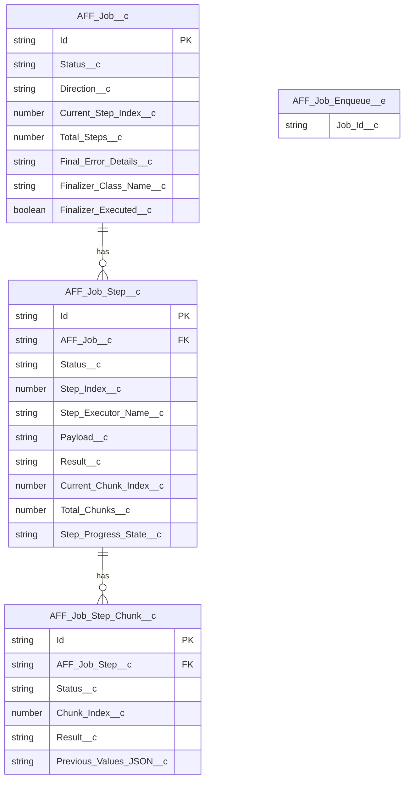
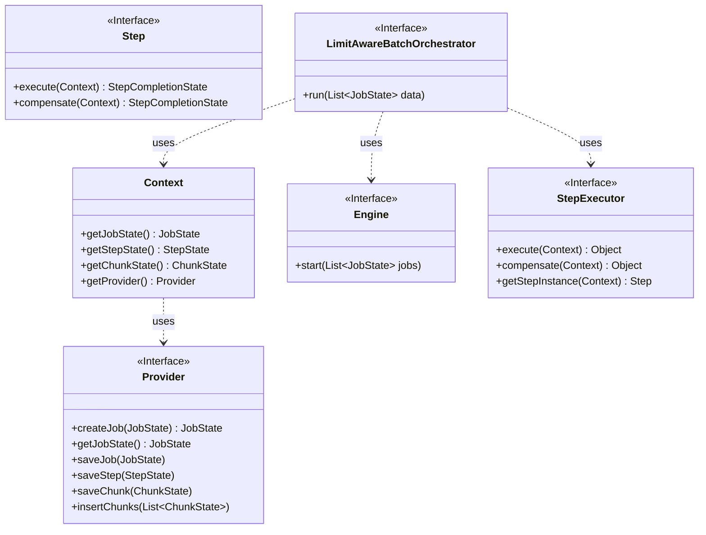
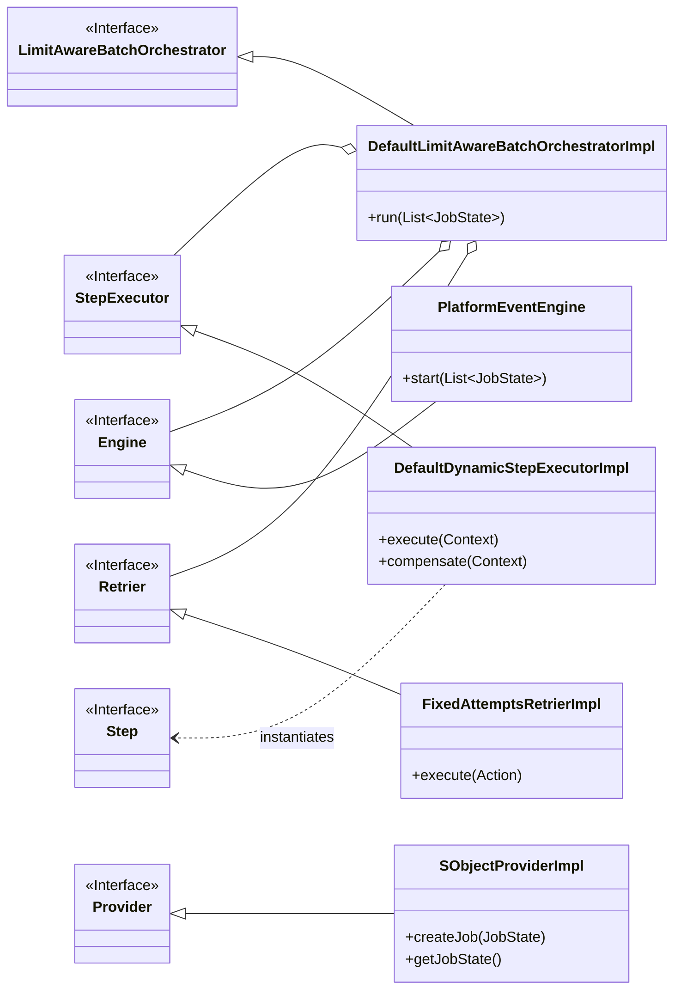
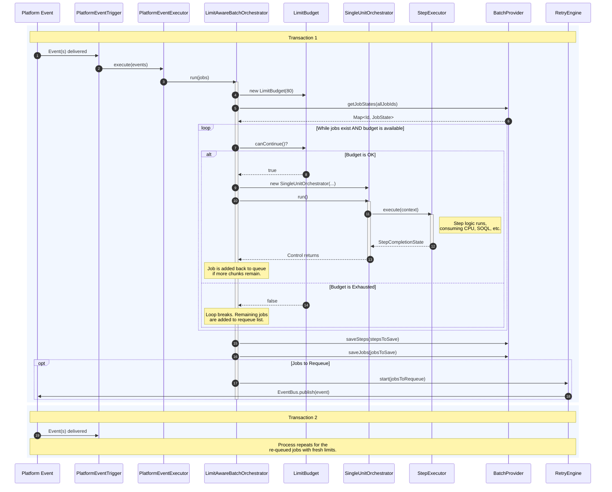
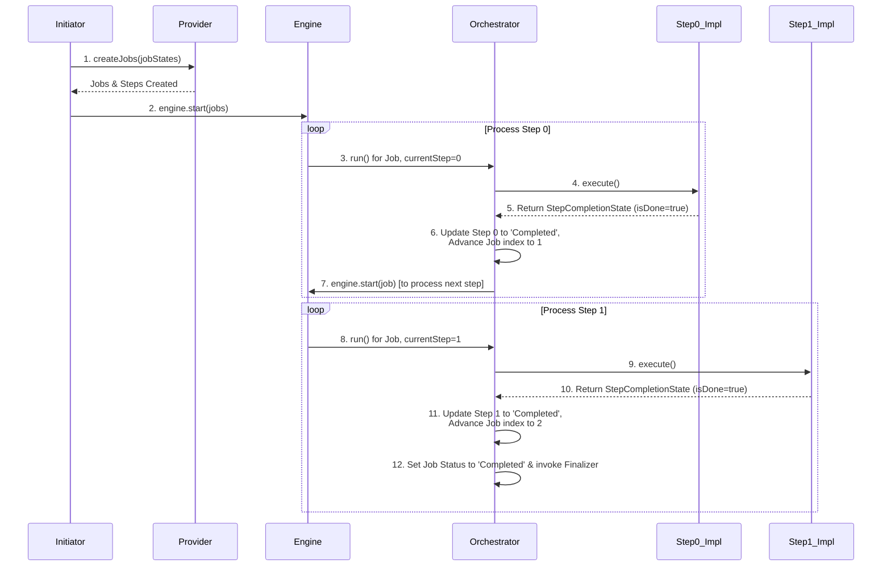
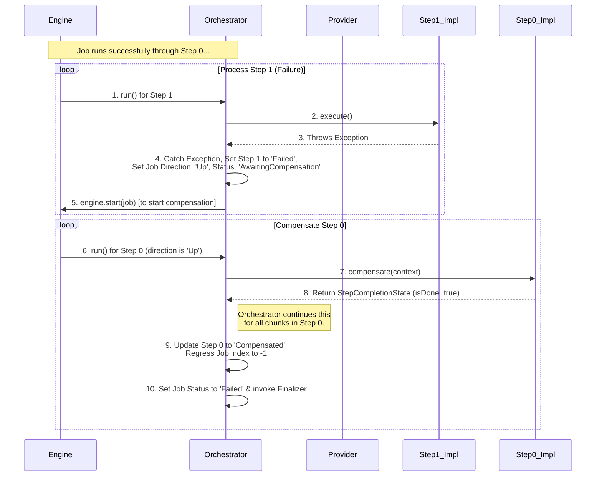
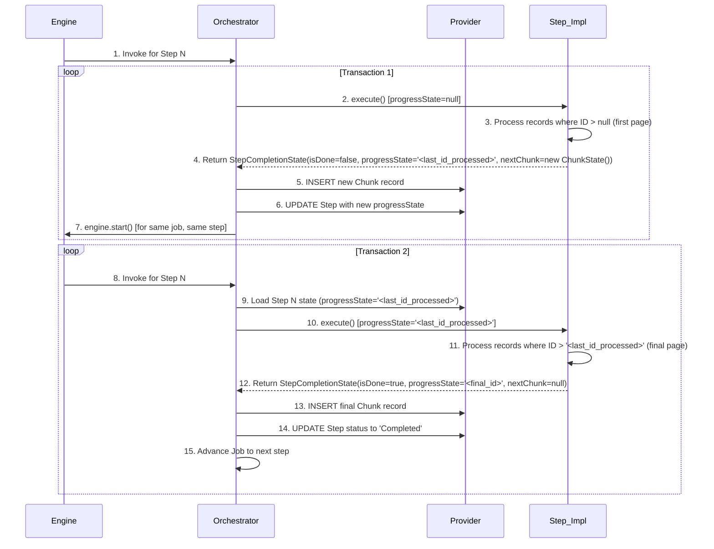

# Architectural Guide: The AFFAsync Saga Pattern for Salesforce

**Table of Contents**

1.  [Introduction](#1-introduction)
    * 1.1. [Core Problem: The Bulk Ownership Transfer Use Case](#11-core-problem-the-bulk-ownership-transfer-use-case)
2.  [The AFFAsync Saga Pattern](#2-the-affasync-saga-pattern)
    * 2.1. [Key Concepts](#21-key-concepts)
3.  [Architecture and Components](#3-architecture-and-components)
    * 3.1. [Package Components](#31-package-components)
    * 3.2. [Data Model (ERD)](#32-data-model-erd)
    * 3.3. [Core Abstractions (Class Diagram)](#33-core-abstractions-class-diagram)
    * 3.4. [Default Implementation (Class Diagram)](#34-default-implementation-class-diagram)
4.  [Execution Flow (Sequence Diagrams)](#4-execution-flow-sequence-diagrams)
    * 4.1. [Scalable Batch Orchestration with Adaptive Limits](#41-scalable-batch-orchestration-with-adaptive-limits)
    * 4.2. [Successful "Downward" Execution (Single Job)](#42-successful-downward-execution-single-job)
    * 4.3. [Failure & "Upward" Compensation](#43-failure--upward-compensation)
    * 4.4. [Stateful Chunking Within a Single Step](#44-stateful-chunking-within-a-single-step)
5.  [Framework Demo: Bulk Account Ownership Change](#5-framework-demo-bulk-account-ownership-change)
    * 5.1. [Overview of the Demo](#51-overview-of-the-demo)
    * 5.2. [How to Run the Demo](#52-how-to-run-the-demo)
    * 5.3. [Understanding Failure Scenarios](#53-understanding-failure-scenarios)
6.  [Scalability and Error Handling Deep Dive](#6-scalability-and-error-handling-deep-dive)
    * 6.1. [The Adaptive Limits Batch Orchestrator](#61-the-adaptive-limits-batch-orchestrator)
    * 6.2. [Compensation and Failure Modes](#62-compensation-and-failure-modes)
7.  [Developer's Guide: Implementing a Long-Running Process](#7-developers-guide-implementing-a-long-running-process)
    * 7.1. [Step 1: Implement the `AFFAsync.Step` Interface](#71-step-1-implement-the-affasyncstep-interface)
    * 7.2. [Step 2: Create a Job Initiator](#72-step-2-create-a-job-initiator)
    * 7.3. [Step 3: Configure the Asynchronous Engine](#73-step-3-configure-the-asynchronous-engine)
    * 7.4. [Step 4: (Optional) Implement a Finalizer](#74-step-4-optional-implement-a-finalizer)
    * 7.5. [Step 5: Monitor and Observe](#75-step-5-monitor-and-observe)
8.  [Advanced Topics](#8-advanced-topics)
    * 8.1. [Scalable Result Aggregation](#81-scalable-result-aggregation)
    * 8.2. [Engine Agnosticism and Pluggable Architectures](#82-engine-agnosticism-and-pluggable-architectures)
9.  [Pros and Cons](#9-pros-and-cons)
10. [Appendix: Demo Execution Script](#10-appendix-demo-execution-script)

---

## 1. Introduction

Many critical business processes in Salesforce are inherently long-running operations. Executing these within Salesforce governor limits presents a significant architectural challenge. A single, monolithic transaction is rarely feasible, requiring a more sophisticated, fault-tolerant approach.

This document presents a generic, reusable solution: the **AFFAsync (Apex Foundation Framework - Asynchronous)** module. AFFAsync provides a production-grade implementation of the **Saga pattern**, designed specifically to create robust, stateful, and compensatable asynchronous processes that achieve eventual consistency. It offers a standardized framework for any long-running task, handling the complex orchestration, state management, and error recovery so that developers can focus on implementing the specific business logic required for each step of their process.

### 1.1. Core Problem: The Bulk Ownership Transfer Use Case

To illustrate the framework's practical application, this guide will use the common business requirement of transferring ownership of an Account and all its related records (Contacts, Opportunities, etc.) in bulk. Performing this for hundreds of accounts simultaneously requires a carefully orchestrated, multi-transaction approach. The AFFAsync framework provides the necessary tools to solve this problem reliably.

---

## 2. The AFFAsync Saga Pattern

Instead of building a one-off solution, we leverage the AFFAsync framework, which provides the core orchestration, state management, and error handling logic.

### 2.1. Key Concepts

* **Saga**: A sequence of distinct transactions that can be compensated. If any transaction in the sequence fails, a series of compensating transactions are executed in reverse order to undo the changes made by the preceding successful transactions.
* **Job**: The master record (`AFF_Job__c`) representing the entire end-to-end business process (e.g., "Transfer Account X"). It tracks the overall status and current position in the sequence of steps.
* **Step**: A single, logical, and compensatable stage within a Job (`AFF_Job_Step__c`), executed by a specific Apex class.
* **Chunk**: A small, transactional unit of work within a Step (`AFF_Job_Step_Chunk__c`). A single Step can be broken down into many chunks to process thousands of records without violating governor limits.
* **Orchestrator**: A central Apex class that drives the process. It inspects the current state of the Job and decides whether to execute the next step (`Down` direction) or trigger a rollback (`Up` direction for compensation). The `DefaultLimitAwareBatchOrchestratorImpl` is designed to process multiple jobs in a single transaction while respecting governor limits.
* **Engine**: The mechanism for chaining transactions, defined by the swappable `AFFAsync.Engine` interface. This makes the framework **engine-agnostic**. While the default `PlatformEventEngine` is provided, developers can implement their own engine using other asynchronous tools (`Queueable`, `Schedulable`, etc.) to best fit their use case.
* **Provider**: An interface for data persistence, abstracting the data layer from the orchestration logic. The default implementation uses the custom SObjects.

---

## 3. Architecture and Components

### 3.1. Package Components

The `AFFAsync` module consists of the following metadata components, which should be deployed to a Salesforce org.

```xml
<?xml version="1.0" encoding="UTF-8" standalone="yes" ?>
<Package xmlns="[http://soap.sforce.com/2006/04/metadata](http://soap.sforce.com/2006/04/metadata)">
    <types>
        <members>AFF_DEMO_AFFAsync_AccRelOwnerChanger</members>
        <members>AFFAsync</members>
        <members>AFFAsyncBatchAggregationTest</members>
        <members>AFFAsyncBatchProviderTest</members>
        <members>AFFAsyncConsts</members>
        <members>AFFAsyncEng</members>
        <members>AFFAsyncEngTest</members>
        <members>AFFAsyncTest</members>
        <members>AFFBase</members>
        <members>AFFBaseTest</members>
        <members>AFFError</members>
        <members>AFFErrorTest</members>
        <members>AFFLimit</members>
        <members>AFFLimitTest</members>
        <name>ApexClass</name>
    </types>
    <types>
        <members>AFF_Job_Enqueue_trigger</members>
        <name>ApexTrigger</name>
    </types>
    <types>
        <members>AFF_Job__c</members>
        <members>AFF_Job_Step__c</members>
        <members>AFF_Job_Step_Chunk__c</members>
        <members>AFF_Job_Enqueue__e</members>
        <name>CustomObject</name>
    </types>
    <version>62.0</version>
</Package>
```

### 3.2. Data Model (ERD)

The framework's state is persisted across four core SObjects. This stateful design is the key to its robustness, allowing processes to be paused and resumed.



### 3.3. Core Abstractions (Class Diagram)

These interfaces define the framework's primary contracts and extension points.



### 3.4. Default Implementation (Class Diagram)

The framework provides a set of default classes that implement the core interfaces, providing out-of-the-box functionality based on SObjects and Platform Events.



---

## 4. Execution Flow (Sequence Diagrams)

### 4.1. Scalable Batch Orchestration with Adaptive Limits

The `DefaultLimitAwareBatchOrchestratorImpl` is the heart of the system. This diagram shows how it processes a list of jobs within a single transaction, respecting governor limits and re-queueing work when necessary.



### 4.2. Successful "Downward" Execution (Single Job)

This diagram shows one job with two steps completing successfully within the orchestrator.



### 4.3. Failure & "Upward" Compensation

This diagram shows a job failing at Step 1. The Orchestrator detects the failure, flips the job's direction to `Up`, and begins executing the `compensate` methods of previously completed steps in reverse order.



### 4.4. Stateful Chunking Within a Single Step

This diagram shows how a single step processes a large number of records across multiple, independent transactions to avoid governor limits, using PK Chunking.



---

## 5. Framework Demo: Bulk Account Ownership Change

The framework includes a powerful, end-to-end demonstration class, `AFF_DEMO_AFFAsync_AccRelOwnerChanger`, and an anonymous Apex script, `affasync_pe_saga_job_executor.apex`, to showcase its capabilities.

### 5.1. Overview of the Demo

The demo simulates a bulk ownership change for 60 accounts and their related records (Contacts, Opportunities, Tasks). It is designed to be fully self-contained and includes methods for:

* **`setupSampleData()`**: Creates all necessary accounts and related records.
* **`startOwnershipChange()`**: Initiates the AFFAsync jobs.
* **`validateResults()`**: Automatically asserts the final state of the data and jobs.
* **`cleanupData()`**: Deletes all demo data and jobs.

Most importantly, it includes a sophisticated failure injection mechanism to test every possible outcome of the Saga pattern.

### 5.2. How to Run the Demo

Use the `affasync_pe_saga_job_executor.apex` script to easily run the demo.

**Step 1: Configure Users**
Open the script and set the `originalOwnerLogin` and `newOwnerLogin` variables to valid, active usernames in your org.

```apex
// Replace with the username of the data's original owner.
final String originalOwnerLogin = 'your.user@example.com';
// Replace with the username of the user who should become the new owner.
final String newOwnerLogin = 'another.user@example.com';
```

**Step 2: Choose a Test Scenario**
The script contains four pre-configured use cases. **Uncomment only ONE** to run a specific test.

* **Use Case 1: Successful Execution**: No failures are injected.
* **Use Case 2: Successful Compensation**: A reversible error is thrown, forcing a full rollback.
* **Use Case 3: Failed Compensation**: A critical test where the rollback *itself* fails, leaving data in an inconsistent state and marking the job as `Compensation_Failed`.
* **Use Case 4: Permanent Failure**: An unrecoverable error occurs, halting the job immediately with no attempt at compensation.

**Step 3: Execute the Steps**
Run the steps in the "EXECUTION STEPS" section of the script sequentially using your IDE's "Execute Anonymous Apex" function.

1.  **`cleanupData()`**: (Recommended first run) Clears any old demo data.
2.  **`setupSampleData()`**: Creates the test data set.
3.  **`startOwnershipChange()`**: Kicks off the AFFAsync jobs. This will create Platform Events, which the `AFF_Job_Enqueue_trigger` will process asynchronously.
4.  **Monitor and Validate**:
    * Because the process is asynchronous, you must wait for the jobs to finish. Open the Developer Console and run the following SOQL query. You may need to run it a few times until all jobs show a terminal status (`Completed`, `Failed`, or `Compensation_Failed`).
        ```soql
        SELECT Id, Status__c, Direction__c, Final_Error_Details__c 
        FROM AFF_Job__c 
        WHERE CreatedDate = TODAY
        ```
    * Once all jobs are in a finished state, you can run the automated validation method from the script to confirm the outcome:
        ```apex
        AFF_DEMO_AFFAsync_AccRelOwnerChanger.validateResults(failures, originalOwnerLogin, newOwnerLogin);
        ```

### 5.3. Understanding Failure Scenarios

The demo's `FailureConfig` allows you to pinpoint exactly where and how a job should fail.

```apex
// Example: Make the 'Opportunity' step fail reversibly.
failures = new Map<String, AFF_DEMO_AFFAsync_AccRelOwnerChanger.FailureConfig>{
    'Opportunity' => new AFF_DEMO_AFFAsync_AccRelOwnerChanger.FailureConfig(
        AFF_DEMO_AFFAsync_AccRelOwnerChanger.FailureType.REVERSIBLE,
        AFFAsyncConsts.STATUS_FAILED // This is the expected final job status
      )
};
```

By changing the `FailureType` (`REVERSIBLE`, `PERMANENT`, `COMPENSATION_FAIL`) and the target step (`Account`, `Contact`, etc.), you can simulate and validate every path through the Saga state machine.

---

## 6. Scalability and Error Handling Deep Dive

### 6.1. The Adaptive Limits Batch Orchestrator

The `DefaultLimitAwareBatchOrchestratorImpl` is designed for high-throughput environments. It processes a batch of jobs from the Platform Event trigger, but it does so intelligently.

1.  **Budgeting**: At the start of its `run` method, it creates an `AFFLimit.Budget` instance, configured to use 80% of major governor limits (SOQL queries, DML statements, CPU time).
2.  **Iterative Processing**: It processes one job at a time from its input list.
3.  **Budget Check**: Before processing each job, it calls `budget.canContinue()`.
4.  **Re-queueing**: If the budget is exhausted, the orchestrator stops processing, takes the remaining unprocessed jobs, and re-enqueues them by calling `retryEngine.start()`. This fires a new, independent Platform Event, effectively chaining the work into a new transaction without ever hitting a limit.

This adaptive, self-throttling behavior ensures that the system can handle bursts of hundreds or thousands of jobs without failing due to governor limits.

### 6.2. Compensation and Failure Modes

The framework, as demonstrated by `AFF_DEMO_AFFAsync_AccRelOwnerChanger`, robustly handles different kinds of errors.

* **Reversible Failure (e.g., `DemoException`)**: When a step throws a standard exception, the orchestrator catches it and initiates compensation. It flips the job's `Direction__c` to `Up` and begins executing the `compensate` method of each previously `Completed` step, in reverse order. The final job status is `Failed` because the forward process did not complete, but the data is returned to its original consistent state.
* **Permanent Failure (e.g., `AFFAsync.PermanentFailureException`)**: If a step throws this specific exception type, the orchestrator immediately halts all processing for that job. **No compensation is attempted.** The job is marked `Failed`, and the `Final_Error_Details__c` field is populated. This is for unrecoverable errors where a rollback is impossible or undesirable. The data is left in an inconsistent state, requiring manual intervention.
* **Compensation Failure**: This is the most critical scenario. If an exception occurs *during* the execution of a `compensate` method, the orchestrator halts the rollback and sets the job's status to `Compensation_Failed`. This is a clear, unambiguous signal to administrators that the system could not automatically recover and the data is in a partially compensated, inconsistent state that requires immediate manual investigation and cleanup.

---

## 7. Developer's Guide: Implementing a Long-Running Process

### 7.1. Step 1: Implement the `AFFAsync.Step` Interface

For each logical stage of your business process, create a new Apex class that implements `AFFAsync.Step`. The abstract class `RelatedRecordsOwnerChange_Step` from the demo provides an excellent, production-ready template for implementing a stateful, chunked, and compensatable step using PK Chunking.

```apex
/**
 * @description Abstract base class for chunked owner changes of related records using PK Chunking.
 */
public abstract with sharing class RelatedRecordsOwnerChange_Step implements AFFAsync.Step {
    protected abstract String getSObjectType();
    protected abstract String getLookupFieldName();
    protected virtual Integer getChunkSize() {
        return 200; // A reasonable default chunk size
    }

    public virtual AFFAsync.StepCompletionState execute(AFFAsync.Context context) {
        Map<String, Object> payload = context.getStepState().payload;
        Id accountId = (Id) payload.get('accountId');
        Id newOwnerId = (Id) payload.get('newOwnerId');
        String lastProcessedId = context.getStepState().progressState;

        String query = 'SELECT Id FROM ' + getSObjectType() +
                       ' WHERE ' + getLookupFieldName() + ' = :accountId';
        if (String.isNotBlank(lastProcessedId)) {
            query += ' AND Id > \'' + String.escapeSingleQuotes(lastProcessedId) + '\'';
        }
        query += ' ORDER BY Id ASC LIMIT ' + getChunkSize();

        List<SObject> recordsToProcess = Database.query(query);

        if (!recordsToProcess.isEmpty()) {
            List<SObject> recordsToUpdate = new List<SObject>();
            for (SObject record : recordsToProcess) {
                SObject sObj = (SObject) Type.forName(getSObjectType()).newInstance();
                sObj.put('Id', record.Id);
                sObj.put('OwnerId', newOwnerId);
                recordsToUpdate.add(sObj);
            }
            update as system recordsToUpdate;
            lastProcessedId = recordsToProcess[recordsToProcess.size() - 1].Id;
        }

        AFFAsync.ChunkState nextChunk = (recordsToProcess.size() == getChunkSize()) ? new AFFAsync.ChunkState() : null;

        return new AFFAsync.StepCompletionState(
            nextChunk == null, // isChunkCompleted
            recordsToProcess.size() + ' ' + getSObjectType() + 's updated.', // partialResult
            lastProcessedId, // nextStepProgressState
            nextChunk
        );
    }

    public virtual AFFAsync.StepCompletionState compensate(AFFAsync.Context context) {
        Map<String, Object> payload = context.getStepState().payload;
        Id accountId = (Id) payload.get('accountId');
        Id originalOwnerId = (Id) payload.get('originalOwnerId');
        Id newOwnerId = (Id) payload.get('newOwnerId');
        String lastProcessedId = context.getStepState().progressState;

        String query = 'SELECT Id FROM ' + getSObjectType() +
                       ' WHERE ' + getLookupFieldName() + ' = :accountId' +
                       ' AND OwnerId = :newOwnerId';
        if (String.isNotBlank(lastProcessedId)) {
            query += ' AND Id > \'' + String.escapeSingleQuotes(lastProcessedId) + '\'';
        }
        query += ' ORDER BY Id ASC LIMIT ' + getChunkSize();

        List<SObject> recordsToProcess = Database.query(query);

        if (!recordsToProcess.isEmpty()) {
            List<SObject> recordsToUpdate = new List<SObject>();
            for (SObject record : recordsToProcess) {
                SObject sObj = (SObject) Type.forName(getSObjectType()).newInstance();
                sObj.put('Id', record.Id);
                sObj.put('OwnerId', originalOwnerId);
                recordsToUpdate.add(sObj);
            }
            update as system recordsToUpdate;
            lastProcessedId = recordsToProcess[recordsToProcess.size() - 1].Id;
        }

        AFFAsync.ChunkState nextChunk = (recordsToProcess.size() == getChunkSize()) ? new AFFAsync.ChunkState() : null;

        return new AFFAsync.StepCompletionState(
            nextChunk == null,
            recordsToProcess.size() + ' ' + getSObjectType() + 's compensated.',
            lastProcessedId,
            nextChunk
        );
    }
}
```

### 7.2. Step 2: Create a Job Initiator

You need a mechanism to create the `AFF_Job__c` and its child `AFF_Job_Step__c` records. This can be a trigger, a Batch Apex job, or a custom UI controller. The initiator defines the sequence of steps for a particular Saga.

```apex
public with sharing class MyJobInitiator {

    public static void startNewJob(Id recordId) {
        // 1. Create the main job DTO
        AFFAsync.JobState job = new AFFAsync.JobState();
        job.steps = new List<AFFAsync.StepState>();

        // 2. Define Step 1
        Map<String, Object> step1Payload = new Map<String, Object>{ 'recordId' => recordId };
        job.steps.add(new AFFAsync.StepState(0, 'MyCustomStep', step1Payload));

        // 3. Define Step 2
        Map<String, Object> step2Payload = new Map<String, Object>{ 'someOtherValue' => 'abc' };
        job.steps.add(new AFFAsync.StepState(1, 'MyOtherStep', step2Payload));
        
        job.totalSteps = job.steps.size();

        // 4. Persist and start the job
        AFFAsync.BatchProvider provider = new AFFAsync.DefaultBatchProviderImpl();
        List<AFFAsync.JobState> createdJobs = provider.createJobs(new List<AFFAsync.JobState>{ job });
        
        AFFAsync.Engine engine = new AFFAsyncEng.PlatformEventEngine();
        engine.start(createdJobs);
    }
}
```

### 7.3. Step 3: Configure the Asynchronous Engine

A core design principle of the AFFAsync framework is that it is **engine-agnostic**. The orchestrator only depends on the `AFFAsync.Engine` interface, not a specific implementation. While the `PlatformEventEngine` is provided as a robust, decoupled default, you are free to create your own.

The recommended `PlatformEventEngine` is pre-configured. You only need to ensure the `AFF_Job_Enqueue__e` Platform Event and the `AFF_Job_Enqueue_trigger` are deployed. When your initiator calls `engine.start(jobs)`, it publishes events that the trigger picks up, starting the orchestration. See the section on [Engine Agnosticism](#82-engine-agnosticism-and-pluggable-architectures) for more details on creating your own engine.

### 7.4. Step 4: (Optional) Implement a Finalizer

If you need to perform a specific action after a job finishes (successfully or not), you can implement the `AFFAsync.Finalizable` interface. Assign the class name to the `JobState.finalizerClassName` field during job creation. The orchestrator will automatically instantiate and call the `onFinish` method when the job reaches a terminal state (`Completed`, `Failed`, `Compensation_Failed`).

```apex
// From AFF_DEMO_AFFAsync_AccRelOwnerChanger
public with sharing class AccRelOwnerChanger_Finalizer implements AFFAsync.Finalizable {
    public void onFinish(AFFAsync.JobState finalJobState) {
        if (finalJobState.status == AFFAsyncConsts.STATUS_COMPLETED) {
            System.debug('Job ' + finalJobState.jobId + ' completed successfully.');
        } else {
            System.debug(LoggingLevel.ERROR, 'Job ' + finalJobState.jobId + ' finished with status ' + finalJobState.status);
        }
    }
}
```

### 7.5. Step 5: Monitor and Observe

Create list views or reports on the `AFF_Job__c` object to monitor the health of your asynchronous processes. Filter by `Status__c` to quickly find jobs that require attention, such as those in `Failed` or `Compensation_Failed` states. Use the `Final_Error_Details__c` field to diagnose issues.

---

## 8. Advanced Topics

### 8.1. Scalable Result Aggregation

Sometimes, the final result of a step is an aggregation of the results from all its individual chunks (e.g., calculating the total number of records updated, or summing a currency field across all processed records). When dealing with a large number of chunks, loading all `AFF_Job_Step_Chunk__c` records into memory at once to calculate the final result can exceed the heap size limit.

To solve this, the framework provides the `AFFAsync.BatchAggregatable` interface. It allows for stateful, batch-based aggregation that works similarly to `Database.Batchable`. When a step's execution is complete (all chunks are processed), the orchestrator will automatically detect if the step's class implements `BatchAggregatable` and, if so, will execute the aggregation logic.

**How It Works:**

1.  **`startAggregation`**: Called once at the beginning. It should initialize and return the starting state for the aggregation (e.g., a counter at 0 or an empty list).
2.  **`executeAggregation`**: Called for each batch of `ChunkState` records. It takes the current aggregated state and the list of chunks and returns the updated state. The framework handles querying and batching the chunks.
3.  **`finishAggregation`**: Called once at the end with the final aggregated state. This is where you can perform any final transformations before the result is saved to the parent `AFF_Job_Step__c` record.

**Example: A Step to Count All Related Opportunities**

Here is an example of a step that changes the description of all Opportunities related to an Account and uses `BatchAggregatable` to return the total count of records processed.

```apex
public with sharing class OpportunityCounterStep implements AFFAsync.Step, AFFAsync.BatchAggregatable {

    // The main execution logic, processes one chunk of opportunities.
    public AFFAsync.StepCompletionState execute(AFFAsync.Context context) {
        Map<String, Object> payload = context.getStepState().payload;
        Id accountId = (Id)payload.get('accountId');
        String lastProcessedId = context.getStepState().progressState;
        Integer chunkSize = 200;

        // Standard PK Chunking query
        String query = 'SELECT Id FROM Opportunity WHERE AccountId = :accountId';
        if (String.isNotBlank(lastProcessedId)) {
            query += ' AND Id > \'' + String.escapeSingleQuotes(lastProcessedId) + '\'';
        }
        query += ' ORDER BY Id ASC LIMIT ' + chunkSize;

        List<Opportunity> oppsToProcess = Database.query(query);

        if (!oppsToProcess.isEmpty()) {
            // Business logic here... e.g., update description
            for (Opportunity opp : oppsToProcess) {
                opp.Description = 'Processed by AFFAsync Job ' + context.getJobState().jobId;
            }
            update oppsToProcess;
            lastProcessedId = oppsToProcess[oppsToProcess.size() - 1].Id;
        }

        boolean isDone = oppsToProcess.size() < chunkSize;
        AFFAsync.ChunkState nextChunk = isDone ? null : new AFFAsync.ChunkState();

        // The partial result for THIS CHUNK is the number of records it processed.
        // This will be saved on the AFF_Job_Step_Chunk__c record.
        Object partialResult = oppsToProcess.size();

        return new AFFAsync.StepCompletionState(isDone, partialResult, lastProcessedId, nextChunk);
    }

    // Compensation logic is omitted for brevity but required for production code.
    public AFFAsync.StepCompletionState compensate(AFFAsync.Context context) {
        return new AFFAsync.StepCompletionState(true, 'Compensation not implemented.', null);
    }

    // --- BatchAggregatable Implementation ---

    // 1. Initialize the aggregate state. Our counter starts at zero.
    public Object startAggregation(AFFAsync.Context context) {
        return 0;
    }

    // 2. Process a batch of chunks.
    public Object executeAggregation(AFFAsync.Context context, Object currentState, List<AFFAsync.ChunkState> chunkBatch) {
        Integer currentCount = (Integer)currentState;
        // Each chunk's 'result' field holds the count for that chunk.
        for (AFFAsync.ChunkState chunk : chunkBatch) {
            if (chunk.result instanceOf Integer) {
                currentCount += (Integer)chunk.result;
            }
        }
        return currentCount; // Return the updated count for the next batch.
    }

    // 3. Finalize the result.
    public Object finishAggregation(AFFAsync.Context context, Object finalState) {
        // Here we can format the final result.
        return 'Total opportunities processed: ' + (Integer)finalState;
    }
}
```

### 8.2. Engine Agnosticism and Pluggable Architectures

One of the most powerful features of the AFFAsync framework is that it is **engine-agnostic**. The core orchestration logic is completely decoupled from the asynchronous mechanism used to chain transactions together. This is achieved through the `AFFAsync.Engine` interface.

While the framework provides the `PlatformEventEngine` as a highly robust and scalable default, you are free to implement your own engine using any of Salesforce's asynchronous features. This allows you to choose the best tool for your specific use case, or even mix and match engines for different types of jobs.

**When to Use a Custom Engine:**

* **Queueable Apex**: A simpler alternative to Platform Events. A `QueueableEngine` could be used for lower-volume processes or when you need to chain jobs that perform callouts, which is not allowed in Platform Event triggers.
* **Schedulable Apex**: A `SchedulableEngine` could be implemented to process jobs on a recurring schedule, such as a nightly batch process.
* **Mixed Engine Strategy**: You could create a facade engine that decides which underlying engine to use based on the job's payload. For example, high-priority jobs could use the `PlatformEventEngine` for near real-time processing, while low-priority jobs could be funneled into a `QueueableEngine` that runs later.

**Example: A Simple `QueueableEngine`**

Here is a conceptual example of what a `Queueable`-based engine might look like.

```apex
// 1. The Queueable class that will execute the orchestrator
public class OrchestratorQueueable implements Queueable {
    private List<AFFAsync.JobState> jobs;

    public OrchestratorQueueable(List<AFFAsync.JobState> jobs) {
        this.jobs = jobs;
    }

    public void execute(QueueableContext qc) {
        // Instantiate the standard orchestrator components
        AFFAsync.StepExecutor executor = new AFFAsync.DefaultDynamicStepExecutorImpl();
        AFFAsync.Retrier retrier = new AFFAsync.FixedAttemptsRetrierImpl(3);
        
        // IMPORTANT: The retry engine here could be a different type,
        // for example, it could re-queue itself or publish a Platform Event.
        AFFAsync.Engine selfEngine = new QueueableEngine();
        AFFAsync.Engine retryEngine = new QueueableEngine(); // or PlatformEventEngine

        AFFAsync.LimitAwareBatchOrchestrator orchestrator = 
            new AFFAsync.DefaultLimitAwareBatchOrchestratorImpl(executor, retrier, selfEngine, retryEngine);
            
        orchestrator.run(this.jobs);
    }
}

// 2. The Engine implementation that enqueues the Queueable
public class QueueableEngine implements AFFAsync.Engine {
    public void start(List<AFFAsync.JobState> jobs) {
        if (jobs == null || jobs.isEmpty()) {
            return;
        }
        // For simplicity, this example enqueues all jobs together.
        // A more advanced version could batch them.
        System.enqueueJob(new OrchestratorQueueable(jobs));
    }
}

// 3. Usage in the Job Initiator
// MyJobInitiator.cls
// ...
// To use the new engine, simply instantiate it instead of the default.
AFFAsync.Engine engine = new QueueableEngine();
engine.start(createdJobs);
// ...
```

---

## 9. Pros and Cons

**Pros:**

* **High Robustness**: The combination of stateful records, the Saga pattern, and built-in retries makes the system highly resilient to failures.
* **Governor Limit Management**: The stateful chunking and adaptive orchestration mechanisms are the ideal patterns for processing large data volumes safely.
* **Separation of Concerns**: The framework handles the complex orchestration, allowing developers to write clean, focused `Step` classes that only contain business logic.
* **Reusability & Flexibility**: The framework is generic. The same module can orchestrate many different business processes. The engine-agnostic design allows architects to choose the best asynchronous tool for the job.
* **Auditing and Monitoring**: The state of every job, step, and chunk is persisted in SObjects, providing excellent visibility and a clear audit trail.

**Cons:**

* **Initial Complexity**: There is a learning curve. Developers must understand the framework's concepts (Saga, Orchestrator, Chunk, Engine) before they can be productive.
* **Implementation Discipline**: The pattern is only as robust as its implementation. Developers *must* correctly implement both the `execute` and `compensate` methods for the Saga to be effective. An error in the `compensate` logic could leave data in an inconsistent state.
* **Record Consumption**: The stateful nature means it creates records for jobs, steps, and chunks, which consumes data storage.
* **Eventual Consistency**: By nature, the Saga pattern is eventually consistent. There will be brief periods during the execution of a job where the data is in an intermediate, inconsistent state.

---

## 10. Appendix: Demo Execution Script

The following anonymous Apex script (`affasync_pe_saga_job_executor.apex`) is used to run the various test scenarios described in the demo section. Since it is not part of the deployable package, its contents are provided here for convenience.

```apex
/**
 * @description
 * Anonymous Apex script for testing the AFFAsync Saga Framework.
 *
 * This script allows you to easily configure and run various test scenarios,
 * including successful execution, reversible failures (successful compensation),
 * permanent failures, and failed compensations.
 *
 * USAGE:
 * 1. Ensure your user logins are correct.
 * 2. Uncomment ONLY ONE of the test case configurations in the "SETUP TEST SCENARIO" section.
 * 3. Uncomment and run the desired execution steps in the "EXECUTION STEPS" section.
 * 4. Use the SOQL queries at the bottom to inspect the results.
 */

//================================================================================
//== USER CONFIGURATION
//================================================================================
// Replace with the username of the data's original owner.
final String originalOwnerLogin = 'user1@someorg.com';
// Replace with the username of the user who should become the new owner.
final String newOwnerLogin = 'user2@someorg.com';


//================================================================================
//== SETUP TEST SCENARIO
//  - Uncomment the ONE test case you wish to run.
//================================================================================

//
// --- USE CASE 1: Successful Execution ---
// No failures are injected. All steps should complete successfully.
//
Map<String, AFF_DEMO_AFFAsync_AccRelOwnerChanger.FailureConfig> failures = null;

//
// --- USE CASE 2: Successful Compensation (Reversible Failure) ---
// DESCRIPTION: This test makes the 'Opportunity' step (Step 2) fail reversibly.
// EXPECTED BEHAVIOR: The framework will execute steps 0 and 1, fail on step 2,
// then reverse direction and successfully compensate steps 1 and 0.
// FINAL JOB STATUS: 'Failed' (because the forward transaction did not complete).
// FINAL DATA STATE: All records should remain owned by the originalOwnerLogin.
//
/*
failures = new Map<String, AFF_DEMO_AFFAsync_AccRelOwnerChanger.FailureConfig>{
    'Opportunity' => new AFF_DEMO_AFFAsync_AccRelOwnerChanger.FailureConfig(
        AFF_DEMO_AFFAsync_AccRelOwnerChanger.FailureType.REVERSIBLE,
        AFFAsyncConsts.STATUS_FAILED
      )
};
*/

//
// --- USE CASE 3: Failed Compensation ---
// DESCRIPTION: This is a critical test. The 'Contact' step (Step 1) is configured
// to FAIL its compensation logic. The 'Opportunity' step (Step 2) is configured
// to fail reversibly, which acts as the trigger to start the rollback process.
// EXPECTED BEHAVIOR: The framework will execute steps 0 and 1, fail on step 2,
// reverse direction, and then attempt to compensate step 1. The compensation for
// step 1 will throw a permanent exception, halting the entire rollback.
// FINAL JOB STATUS: 'Compensation_Failed', signaling that manual data intervention is required.
// FINAL DATA STATE: Inconsistent. 
//
/*
failures = new Map<String, AFF_DEMO_AFFAsync_AccRelOwnerChanger.FailureConfig>{
    'Contact' => new AFF_DEMO_AFFAsync_AccRelOwnerChanger.FailureConfig(
        AFF_DEMO_AFFAsync_AccRelOwnerChanger.FailureType.COMPENSATION_FAIL,
        AFFAsyncConsts.STATUS_COMPENSATION_FAILED
    ),
    'Opportunity' => new AFF_DEMO_AFFAsync_AccRelOwnerChanger.FailureConfig(
      AFF_DEMO_AFFAsync_AccRelOwnerChanger.FailureType.REVERSIBLE,
      AFFAsyncConsts.STATUS_COMPENSATION_FAILED // The final job status is what matters.
    )
};
*/

//
// --- USE CASE 4: Permanent Failure (No Compensation) ---
// DESCRIPTION: This test makes the 'Opportunity' step (Step 2) fail permanently.
// EXPECTED BEHAVIOR: The framework will execute steps 0 and 1, then hit the permanent
// failure on step 2. The job will immediately halt and will NOT attempt any compensation.
// FINAL JOB STATUS: 'Failed'.
// FINAL DATA STATE: Inconsistent. Accounts and Contacts will be owned by the newOwnerLogin,
// but Opportunities and Tasks will remain with the originalOwnerLogin.
//
/*
failures = new Map<String, AFF_DEMO_AFFAsync_AccRelOwnerChanger.FailureConfig>{
    'Opportunity' => new AFF_DEMO_AFFAsync_AccRelOwnerChanger.FailureConfig(
      AFF_DEMO_AFFAsync_AccRelOwnerChanger.FailureType.PERMANENT,
      AFFAsyncConsts.STATUS_FAILED
    )
};
*/

//================================================================================
//== EXECUTION STEPS
// - Uncomment and run these steps sequentially as needed.
//================================================================================

// STEP 0: Clean up all demo data and jobs from previous runs.
// AFF_DEMO_AFFAsync_AccRelOwnerChanger.cleanupData();

// STEP 1: Create fresh sample data for the test.
// AFF_DEMO_AFFAsync_AccRelOwnerChanger.setupSampleData( originalOwnerLogin );

// STEP 2: Start the ownership change jobs with the configured failure scenario.
// AFF_DEMO_AFFAsync_AccRelOwnerChanger.startOwnershipChange( originalOwnerLogin, newOwnerLogin, failures );

// STEP 3: After waiting for jobs to process, run automated validation.
// AFF_DEMO_AFFAsync_AccRelOwnerChanger.validateResults(failures, originalOwnerLogin, newOwnerLogin);


//================================================================================
//== USEFUL SOQL QUERIES
// - Run these in the Query Editor to inspect the state of the system after a test.
//================================================================================

/*
// -- Check Job Status --
SELECT Id, Status__c, Direction__c, Current_Step_Index__c, Final_Error_Details__c
FROM AFF_Job__c
WHERE CreatedDate = TODAY;

// -- Check Step Statuses --
SELECT Id, AFF_Job__c, Step_Index__c, Status__c, Result__c
FROM AFF_Job_Step__c
WHERE AFF_Job__r.CreatedDate = TODAY
ORDER BY AFF_Job__c, Step_Index__c;

// -- check Chunk status
SELECT Id, AFF_Job_Step__c, Chunk_Index__c, Status__c, Result__c
FROM AFF_Job_Step_Chunk__c
WHERE AFF_Job_Step__r.AFF_Job__r.CreatedDate = TODAY;

// -- Check Data Ownership --
SELECT COUNT(Id) FROM Account WHERE Name LIKE 'AFF Demo Account %' AND Owner.Username = :originalOwnerLogin;
SELECT COUNT(Id) FROM Contact WHERE Account.Name LIKE 'AFF Demo Account %' AND Owner.Username = :originalOwnerLogin;
SELECT COUNT(Id) FROM Opportunity WHERE Account.Name LIKE 'AFF Demo Account %' AND Owner.Username = :originalOwnerLogin;
SELECT COUNT(Id) FROM Task WHERE What.Name LIKE 'AFF Demo Account %' AND Owner.Username = :originalOwnerLogin;
*/
```